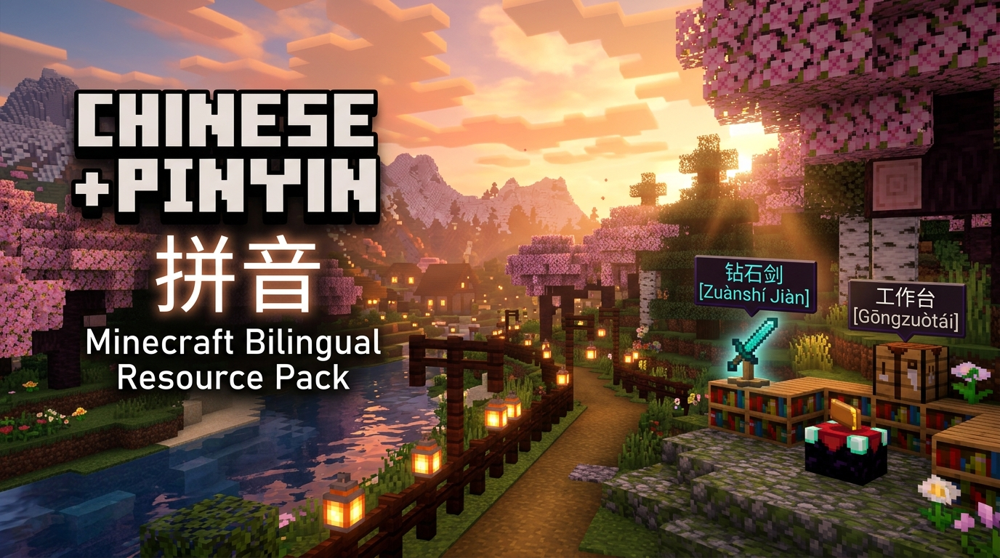

# ⛏️ Minecraft Chinese with Pinyin (拼音) Resource Pack

[](https://github.com/MatthewShkolnik/Minecraft-Chinese-Pinyin-Resource-Pack/releases)
[](https://minecraft.net)
[](https://minecraft.wiki/w/Pack_format)
[](LICENSE)
[](generate_pack.py)

<p align="center">
  
</p>

> **Learn Chinese while dodging Creepers and mining Diamonds — without breaking your slash commands!** 🗡️🐉💎

Have you ever switched Minecraft to Chinese to practice your language skills, only to stare blankly at a wall of complex Hanzi wondering how on earth to pronounce it? Or worse, tried to type `/give @p diamond_sword` or `/locate structure` only to realize the command parser had a meltdown or your muscle memory hit a brick wall?

**Minecraft Chinese with Pinyin** is a resource pack that adds accurate **Hànzì (汉字)** paired with **tonal Pīnyīn (拼音)** across every item, block, entity, biome, and UI element in the game — **while keeping native Minecraft slash commands 100% in English!**

---

## 🌟 What Makes This Pack Special?

* 🀄 **Dual Hanzi + Tone-Marked Pinyin**: Every in-game string is annotated with pronunciation and tone diacritics using intelligent Chinese natural language processing (`jieba` tokenization + `pypinyin`).
* ⚡ **English Slash Commands Preserved**: No broken command syntax! Commands like `/gamemode creative`, `/tp`, `/weather`, `/summon`, and all argument parsing strings stay native English.
* 🌏 **Multi-Dialect & Script Coverage**:
  * 🇨🇳 **Simplified Chinese** (`zh_cn`)
  * 🇭🇰 **Traditional Chinese (Hong Kong)** (`zh_hk`)
  * 🇹🇼 **Traditional Chinese (Taiwan)** (`zh_tw`)
  * 📜 **Literary / Classical Chinese** (`lzh`)
  * 🇺🇸 **English Client Fallback** (`en_us`): Want to keep your game in English but still see Chinese + Pinyin? We've got you covered!
* 🚀 **Automated & Always Up-to-Date**: Built via a Python script that fetches the latest official Mojang client assets directly from the `piston-meta` API.

---

## 💡 Fun Use Cases (Who is this for?)

### 1. 🎓 The "Gamified Immersion" Language Learner
> *"Forget Duolingo guilt trips — learn Chinese by surviving the night!"*

Ditch boring Anki flashcards. With this pack, you encounter hundreds of Chinese vocabulary words in their natural habitat. Want to make bread? You'll read `小麦 (Xiǎomài)` and `工作台 (Gōngzuòtái)`. Crafting armor? You'll master `钻石 (Zuànshí)` and `铁锭 (Tiědìng)`. Because you interact with these items continuously, you absorb pronunciation and character recognition organically.

### 2. 🎮 The International Server Explorer
> *"GG? More like 好球 (Hǎoqiú)!"*

Want to play on high-population Chinese servers (NetEase, Chinese survival realms, mini-game hubs) or join a realm with Mandarin-speaking friends? With this pack, you'll know exactly what items people are trading, what quest boards say, and what boss just spawned, without having to screenshot and alt-tab to Google Translate every five seconds.

### 3. 👨‍👩‍👧 The Heritage Speaker Reconnecting with Hanzi
> *"I can say it, but how do I read it again?"*

If you grew up hearing Mandarin spoken at home, you probably have great listening skills but might struggle when reading unfamiliar characters. The Pinyin tone guides immediately connect the written characters to the spoken words already in your memory.

### 4. 🧭 The Server Admin & Command Wizard
> *"Keep your `/give` and `/teleport` intact!"*

Many translated resource packs aggressively translate commands, making `/execute if entity` or command block chaining an utter nightmare. This pack strictly leaves command syntax, command suggestions, and parser diagnostics in pristine English. Your macros, scripts, and typing muscle memory stay 100% intact.

### 5. 🎬 Content Creators & Streamers
> *"Teaching Chinese to chat while fighting the Wither."*

Doing a language-learning challenge series or streaming bilingual gaming? This pack makes your stream instantly accessible to both English-speaking and Chinese-speaking viewers.

---

## 🔍 In-Game Preview

Here is how items and blocks look compared to standard game settings:

| Object | Standard English | Vanilla Chinese | ✨ With This Pinyin Pack |
| :--- | :--- | :--- | :--- |
| 🗡️ **Diamond Sword** | Diamond Sword | 钻石剑 | `钻石剑 (Zuànshí Jiàn)` |
| 💥 **Creeper** | Creeper | 苦力怕 | `苦力怕 (Kǔlì Pà)` |
| 🪵 **Crafting Table** | Crafting Table | 工作台 | `工作台 (Gōngzuòtái)` |
| 🍎 **Golden Apple** | Golden Apple | 金苹果 | `金苹果 (Jīn Píngguǒ)` |
| 🐉 **Ender Dragon** | Ender Dragon | 末影龙 | `末影龙 (Mòyǐnglóng)` |
| 🧪 **Potion of Swiftness** | Potion of Swiftness | 迅捷药水 | `迅捷药水 (Xùnjié Yàoshuǐ)` |
| ⚡ **Commands** | `/teleport @p ~ ~10 ~` | `/teleport @p ~ ~10 ~` | `/teleport @p ~ ~10 ~` *(Clean English!)* |

---

## 📦 Quick Installation

### Option A: Download the v1.0.0 Release (Recommended)
1. Go to the [Releases](https://github.com/MatthewShkolnik/Minecraft-Chinese-Pinyin-Resource-Pack/releases) page or look in the [`release/`](release/) folder.
2. Download **`Minecraft-Chinese-Pinyin-v1.0.0.zip`**.
3. In Minecraft (Java Edition), navigate to:
   **Options** ➔ **Resource Packs...** ➔ **Open Pack Folder**
4. Drag and drop the `.zip` file into your `resourcepacks` folder.
5. In Minecraft, select the pack into the right-hand column and click **Done**.

### Option B: Quick Folder Paths
* **Windows**: `%appdata%\.minecraft\resourcepacks`
* **macOS**: `~/Library/Application Support/minecraft/resourcepacks`
* **Linux**: `~/.minecraft/resourcepacks`

---

## 🛠️ Building & Regenerating the Pack

Want to regenerate the pack against newer Minecraft snapshots or releases? You can run the generator script anytime:

### 1. Prerequisites
Ensure you have Python 3.9+ installed:
```bash
python --version
```

### 2. Install Dependencies
```bash
pip install -r requirements.txt
```
*(Dependencies: `requests`, `pypinyin`, and `jieba`)*

### 3. Generate the Pack
```bash
python generate_pack.py
```

This will:
1. Query Mojang's official `piston-meta` API for the latest game version and asset indices.
2. Download the native English `en_us` language file from the client JAR.
3. Download Chinese locale files (`zh_cn`, `zh_hk`, `zh_tw`, `lzh`).
4. Perform intelligent Chinese phrase segmentation via `jieba` and apply tone marks via `pypinyin`.
5. Preserve all native English command strings.
6. Package the files into `dist/Pinyin_Resource_Pack/` and `dist/Pinyin_Resource_Pack.zip`.

---

## 📂 Repository Structure

```text
Minecraft-Chinese-Pinyin-Resource-Pack/
├── curseforge/                         # CurseForge Release Graphics
│   ├── curseforge_logo.png             # 1024x1024 Project Avatar
│   ├── curseforge_banner.png           # 1376x768 (16:9) Project Banner
│   └── curseforge_banner_wide.png      # 1376x458 (3:1) Header Banner
├── dist/                               # Generated unpacked pack and zip
│   ├── Pinyin_Resource_Pack/
│   │   ├── assets/minecraft/lang/      # zh_cn, zh_hk, zh_tw, lzh, en_us
│   │   ├── pack.mcmeta
│   │   └── pack.png
│   └── Pinyin_Resource_Pack.zip
├── release/                            # GitHub Release v1.0.0 distribution assets
│   ├── Minecraft-Chinese-Pinyin-v1.0.0.zip
│   ├── RELEASE_NOTES.md
│   ├── SHA256SUMS.txt
│   ├── INSTALL.md
│   ├── pack.mcmeta
│   └── pack.png
├── generate_pack.py                    # Pack generator script
├── pack.png                            # High-resolution pack artwork (256x256)
├── requirements.txt                    # Python dependencies
├── LICENSE                             # MIT License
└── README.md                           # Documentation
```

---

## 🤝 Contributing

Contributions, issues, and feature requests are very welcome!
- Found a mispronounced polyphonic character (多音字)?
- Want support for additional Minecraft versions or Bedrock Edition?
- Feel free to check the [Issues page](https://github.com/MatthewShkolnik/Minecraft-Chinese-Pinyin-Resource-Pack/issues) or submit a Pull Request!

---

## 📜 License

Distributed under the [MIT License](LICENSE).

*Minecraft is a registered trademark of Mojang AB / Microsoft. This project is an independent community resource pack and is not affiliated with Mojang or Microsoft.*
